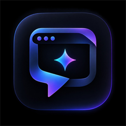
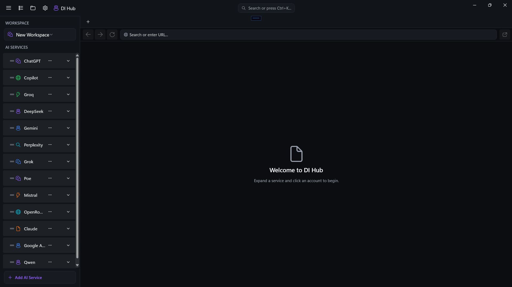
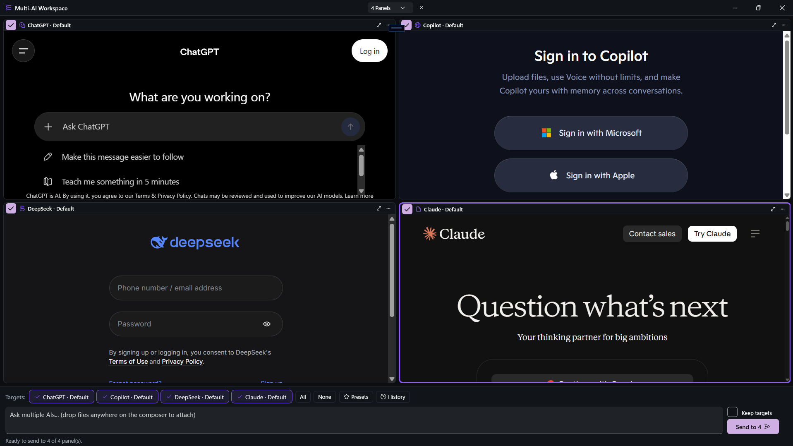
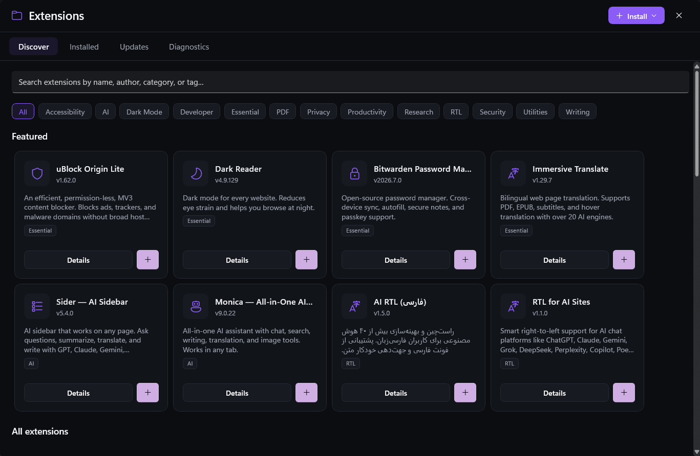
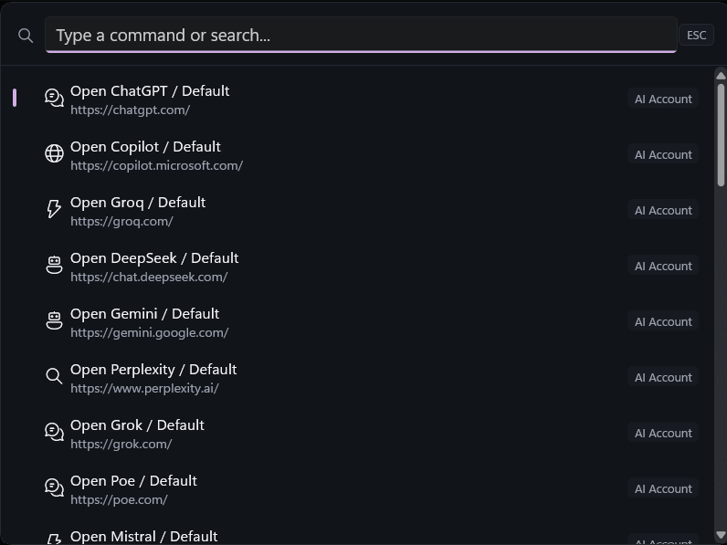
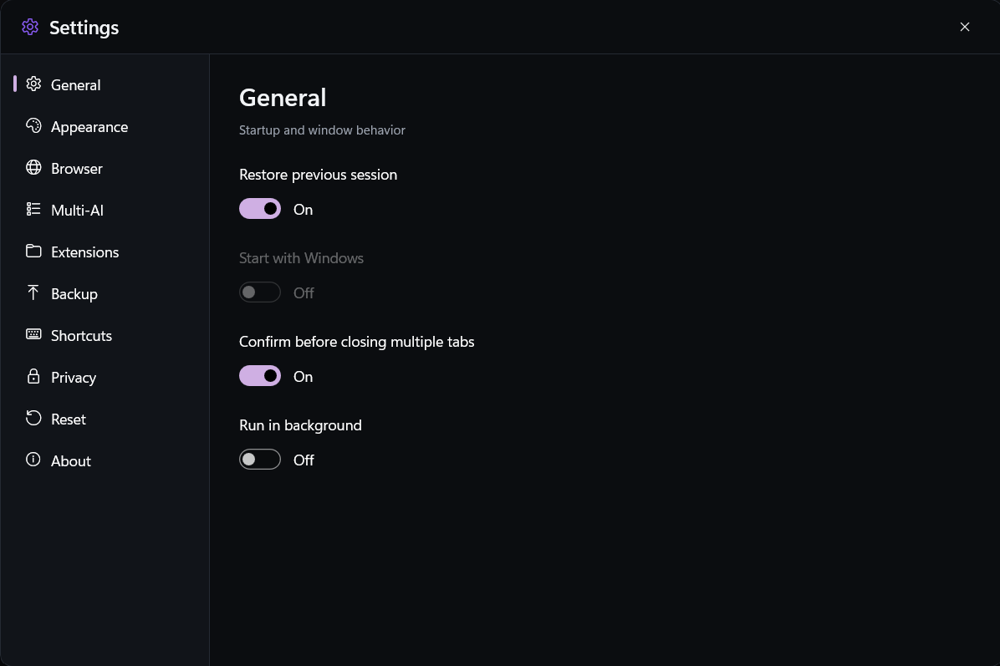

<div align="center">
  
</div>

# <div align="center">🧠 DI Hub</div>

<div align="center">

**Unified AI Workspace for Windows**

*One desktop app. Every AI. Complete control.*

[](https://www.microsoft.com/windows)
[](https://dotnet.microsoft.com/)
[](https://learn.microsoft.com/windows/apps/winui/winui3/)
[](https://developer.microsoft.com/microsoft-edge/webview2/)
[](CHANGELOG.md)
[](#-testing)
[](LICENSE)

[**⬇ Download**](#-installation) · [**✨ Features**](#-features) · [**📸 Screenshots**](#-screenshots) · [**🛠️ Build**](#-build-from-source) · [**🗺️ Roadmap**](#️-roadmap) · [**📄 Changelog**](CHANGELOG.md) · [**📚 Docs**](docs/)

</div>

---

## 📑 Table of Contents

- [Overview](#-overview)
- [Features](#-features)
- [Screenshots](#-screenshots)
- [Installation](#-installation)
- [Quick Start](#-quick-start)
- [Build from Source](#-build-from-source)
- [Architecture](#️-architecture)
- [Testing](#-testing)
- [Privacy & Security](#-privacy--security)
- [Contributing](#-contributing)
- [Roadmap](#️-roadmap)
- [FAQ](#-faq)
- [License](#-license)
- [Acknowledgments](#-acknowledgments)

---

## 🌟 Overview

**DI Hub** is a native Windows desktop application that brings all your AI services together into one beautifully integrated workspace. Instead of juggling dozens of browser tabs, DI Hub gives you:

- 🎯 **Unified access** to every AI service you use
- 👥 **Multiple isolated accounts** per service (personal, work, university…)
- 🪟 **Multi-AI workspaces** — run 2 to 4 AIs side-by-side
- 🧩 **Browser extensions** with per-account scoping
- 🚀 **Native performance** with the power of WebView2

Built with **C# / .NET 10**, **WinUI 3**, and **Windows App SDK**, DI Hub feels like a first-class Windows application — because it is one.

> 💡 **Why?** Because switching between 6 different AI chat tabs 30 times a day is not a workflow. DI Hub makes it one.

---

## ✨ Features

### 🤖 AI Service Management

<div align="center">

| Feature | Description |
|---|---|
| **13 Built-in Services** | ChatGPT, Gemini, Claude, Perplexity, Grok, DeepSeek, Copilot, Poe, Mistral, OpenRouter, Google AI Studio, Groq, Qwen |
| **Custom Services** | Add any AI with custom name, URL, icon, and accent color |
| **Drag & Drop Reorder** | Premium native reordering with insertion indicator |
| **Favorites & Pinning** | Keep your most-used services at the top |
| **Context Menu** | Quick access to open, add account, favorite, delete |

</div>

### 👥 Multi-Account Isolation

Run **the same AI service with multiple fully isolated accounts** — each with its own cookies, sessions, and logins:

```
ChatGPT
├── Personal     ← separate WebView2 profile
├── Work         ← separate WebView2 profile
└── University   ← separate WebView2 profile
```

Each account has its own:

- 🔐 Isolated cookie jar and session storage
- 💾 Dedicated `UserDataFolder` in `%LOCALAPPDATA%\DIHub\Profiles\`
- 🎨 Custom icon, accent, and default status
- 🧩 Independent extension assignments

### 🪟 Multi-AI Workspace

Broadcast one prompt to **2, 3, or 4 AIs simultaneously**:

```
┌──────────────────┬──────────────────┐
│  ChatGPT         │  Claude          │
│  ────────────    │  ────────────    │
│  ...response...  │  ...response...  │
├──────────────────┼──────────────────┤
│  Gemini          │  DeepSeek        │
│  ────────────    │  ────────────    │
│  ...response...  │  ...response...  │
└──────────────────┴──────────────────┘
```

- **Target Chips** — pick exactly which panels receive the prompt
- **Presets** — save target combinations as named templates
- **Prompt History** — last 50 prompts, one-click restore
- **Per-Provider Strategies** — optimized DOM injection for each AI
- **File Attachments** — drag & drop files onto the composer
- **Retry Failed** — resend only to panels that failed
- **Confirmation Dialog** — prevent accidental mass-sends

### 🧩 Extensions Platform

Full-featured browser extension system powered by WebView2:

<div align="center">

| Tab | Purpose |
|---|---|
| 🔍 **Discover** | Browse 29 curated extensions across 13 categories |
| 📦 **Installed** | Enable, disable, remove, and manage scope |
| 🔄 **Updates** | Check for newer versions *(coming soon)* |
| 🩺 **Diagnostics** | WebView2 runtime, installed extensions, assignments |

</div>

**Install methods:**

- ⚡ **One-click** — for curated extensions with direct download URLs
- 🔗 **From URL** — paste a ZIP URL with optional SHA-256 verification
- 📁 **From folder** — local unpacked extension
- 📦 **From ZIP** — local archive with path-traversal protection

**Scope management — Global / Service / Account:**

```
Priority:  Account  >  Service  >  Global
              ↑          ↑           ↑
         (highest)  (middle)    (lowest)
```

Apply one extension to **multiple services and accounts simultaneously** with a single dialog.

**Curated catalog:**

| Category | Extensions |
|---|---|
| ⭐ **Essential** | uBlock Origin Lite, Dark Reader, Bitwarden, Google Translate, Immersive Translate, OneTab |
| 🤖 **AI** | Sider, HARPA AI, Merlin AI, Monica, MaxAI, AIPRM, ChatGPT |
| ✍️ **Writing** | Grammarly, LanguageTool |
| 🔬 **Research** | Immersive Translate, Google Translate |
| 👨‍💻 **Developer** | React Developer Tools, Wappalyzer, JSON Viewer Pro |
| 📚 **Productivity** | Todoist, Notion Web Clipper |
| 📄 **PDF** | Adobe Acrobat |
| 🌐 **RTL** | AI RTL, RTL for AI Sites, RTL Fix for AI Chats, AI Web Chat RTL Support, RTLify for Chatbots, AI RTL Pro |

### 🎨 Modern Windows Experience

- **Custom Title Bar** with adaptive icon hiding
- **Mica Backdrop** on Windows 11 (graceful fallback on Windows 10)
- **Dark / Light / System** themes with live switching
- **5 Accent Colors** — Purple, Blue, Cyan, Green, Orange
- **Smooth animations** throughout — respects "reduce motion"
- **Minimum window size** enforced via Win32 (`WM_GETMINMAXINFO`)
- **Single-instance** — clicking the icon focuses the existing window
- **Toast notifications** for all important actions

### ⌨️ Keyboard-First

<div align="center">

| Shortcut | Action |
|:---:|---|
| `Ctrl + K` | Open Command Palette |
| `Ctrl + L` | Focus address bar |
| `Ctrl + T` | New blank tab |
| `Ctrl + W` | Close current tab |
| `Ctrl + Shift + T` | Restore closed tab |
| `Ctrl + R` | Reload page / Reset Multi-AI layout |
| `Ctrl + Tab` | Next tab / panel |
| `Ctrl + Shift + Tab` | Previous tab / panel |
| `Ctrl + 1…4` | Activate Multi-AI panel N |
| `Ctrl + M` | Maximize Multi-AI panel |
| `Ctrl + Shift + M` | Open Multi-AI workspace |
| `Ctrl + Shift + B` | Toggle sidebar |
| `Ctrl + Shift + D` | Open DevTools |
| `Ctrl + ,` | Open Settings |
| `Esc` | Close dialog / cancel broadcast |

</div>

Plus a **Command Palette** with fuzzy search across AI accounts, services, tabs, workspaces, extensions, appearance, and developer tools.

### 💾 Data & Recovery

- 📤 **Backup** — export services, extensions, and settings as `.dihub` JSON
- 📥 **Restore** — one-click reimport with full validation
- 🔄 **Config Migration** — automatic v1 → v8 with zero data loss
- 🧹 **Selective Reset** — reset individual sections or everything
- 🔐 **Session Restore** — reopen all tabs from last session
- 🖥️ **Window State** — remembers position, size, maximized, across monitors

### 🛡️ Security

- ✅ **URL Policy** — only `http://` and `https://` accepted
- ✅ **Log Redactor** — masks tokens and URL query parameters
- ✅ **ACL Hardening** — config folder restricted to current user
- ✅ **Path-Traversal Protection** — safe ZIP extraction
- ✅ **SHA-256 Verification** — optional for URL-based installs
- ✅ **Manifest Validation** — before any extension executes
- ✅ **HTTPS Only** — for remote extension downloads
- ❌ **No credential extraction** — passwords, cookies, and tokens are never touched

---

## 📸 Screenshots

<div align="center">

**Main Window** — all your AI services in one sidebar, each with isolated accounts



**Multi-AI Workspace** — broadcast one prompt to ChatGPT, Copilot, DeepSeek & Claude side-by-side



| **Extensions — Discover** | **Command Palette** |
|:---:|:---:|
| 29 curated extensions across 13 categories | Fuzzy-search every account, tab & action |
|  |  |

**Settings** — themes, accents, backups, privacy & more



</div>

---

## 📦 Installation

### System Requirements

| Component | Requirement |
|---|---|
| **OS** | Windows 10 (build 19041) or later |
| **WebView2** | Runtime (preinstalled on Windows 11) |
| **RAM** | 4 GB minimum, 8 GB recommended |
| **Disk** | 500 MB free space |
| **Display** | 1280×720 or higher |

### Install via Installer (Recommended)

1. Go to the [**Releases**](https://github.com/The-Dark-L0rd/DIHub/releases) page
2. Download the latest `DIHub-Setup-4.10.0.exe`
3. Run the installer
4. Launch DI Hub from the Start Menu

### Install via MSIX

1. Download `DIHub.APP_4.10.0.0_x64.msix` from Releases
2. Double-click to install
3. Windows will prompt for developer mode or install the provided certificate
4. Launch from Start Menu

> **Note:** The certificate is self-signed for testing. For production use, install the certificate to `Local Machine → Trusted People` first.

### Portable Version

Download `DIHub-4.10.0-Portable.zip`, extract, and run `DIHub.APP.exe`. No installation required.

---

## 🚀 Quick Start

| Step | Action |
|:---:|---|
| **1** | **Add an AI Service** — 13 popular services are pre-configured; click any of them in the sidebar to open. |
| **2** | **Create Multiple Accounts** — Right-click a service → **Add Account** → name it (e.g., "Personal", "Work"). Each account gets its own isolated browser profile. |
| **3** | **Sign In** — Click the account → a WebView2 tab opens → sign in normally. The session is stored in that account's profile only. |
| **4** | **Try Multi-AI** — Press `Ctrl + Shift + M` → choose 2/3/4 panels → assign AIs → type a prompt → **Send to All**. |
| **5** | **Install Extensions** — Press the 🧩 icon → browse the catalog → click `[+]` to install. |

> 💡 **One-click install ready:** uBlock Origin Lite, Dark Reader, and Immersive Translate. For other extensions, download the ZIP from the official source and use **Install → From URL**.

---

## 🛠️ Build from Source

### Prerequisites

- **Visual Studio 2026** (or VS 2022 17.10+) with:
  - .NET Desktop Development workload
  - Windows App SDK C# Templates
- **.NET 10 SDK** ([download](https://dotnet.microsoft.com/download))
- **Git**

### Clone & Build

```bash
git clone https://github.com/The-Dark-L0rd/DIHub.git
cd DIHub

# Restore NuGet packages
dotnet restore DIHub.slnx

# Build (Debug / Release)
dotnet build DIHub.slnx
dotnet build DIHub.slnx -c Release

# Run tests
dotnet test DIHub.slnx

# Run the app
dotnet run --project DIHub.APP
```

### Publish a Release

```bash
# Framework-dependent (requires .NET 10 runtime on target machine)
dotnet publish DIHub.APP/DIHub.APP.csproj ^
    -c Release ^
    -r win-x64 ^
    --self-contained false ^
    -o Publish/Release

# Self-contained (larger, no runtime needed)
dotnet publish DIHub.APP/DIHub.APP.csproj ^
    -c Release ^
    -r win-x64 ^
    --self-contained true ^
    -p:PublishSingleFile=false ^
    -o Publish/Release-SelfContained
```

### Create MSIX Package

**In Visual Studio:**

```
Right-click DIHub.APP → Publish → Create App Packages
→ Sideloading → Yes, use current certificate
→ Configuration: Release
→ Platform: x64
→ Create
```

**In VS Code:** Install the [WinDev Helper](https://marketplace.visualstudio.com/items?itemName=AlvinAshcraft.windev-helper) extension, then right-click `DIHub.APP` in Solution Explorer → **Create MSIX Package**.

### Create Installer

1. Install [Inno Setup 6](https://jrsoftware.org/isinfo.php)
2. Open `Installer/DIHub.iss` in Inno Setup Compiler
3. Press `F9` to compile
4. Output: `Installer/Output/DIHub-Setup-4.10.0.exe`

---

## 🏗️ Architecture

```
DI Hub
│
├── DIHub.APP/                    WinUI 3 UI layer
│   ├── Controls/                 WebView2Host, CommandPalette, ToastHost, ExtensionCard…
│   ├── Views/                    MainView, MultiAIView, SettingsView, ExtensionsView…
│   ├── ViewModels/               MainWindowViewModel, ExtensionsViewModel
│   ├── Services/                 PromptDispatcher, ExtensionProfileApplier, PromptStrategies
│   └── Themes/                   Colors.xaml, Typography.xaml, Spacing.xaml
│
├── DIHub.Core/                   Domain — no UI, no WebView2
│   ├── Models/                   AIService, AIAccount, TabItem, ExtensionInfo…
│   ├── Interfaces/               IAIServiceManager, IExtensionManager…
│   ├── Services/                 AIServiceManager, AIAccountManager, WorkspaceManager…
│   └── Security/                 UrlPolicy, LogRedactor
│
├── DIHub.Infrastructure/         Storage, Web, Extensions
│   ├── Storage/                  JsonConfigurationStorage, ConfigurationMigrator, BackupService
│   ├── Web/                      BrowserService
│   └── Extensions/               ExtensionManager, ExtensionValidator, SafeZipExtractor,
│                                 ExtensionDownloader, ExtensionCatalogService…
│
└── DIHub.Tests/                  xUnit + Moq
    ├── Extensions/               44 tests
    ├── Security/                 30 tests
    ├── Services/                 56 tests
    ├── Storage/                  7 tests
    └── Web/                      19 tests
```

### Architectural Principles

| Principle | Application |
|---|---|
| **Clean Architecture** | `Core` has zero dependencies on `Infrastructure` or `APP` |
| **MVVM** | CommunityToolkit.Mvvm with `[ObservableProperty]` fields |
| **Dependency Injection** | Microsoft.Extensions.Hosting |
| **Central Package Management** | All versions in `Directory.Packages.props` |
| **Atomic Config Writes** | Temp file + `File.Replace` |
| **WebView2 Profile Isolation** | Per-account `UserDataFolder` |
| **Lazy Extension Loading** | Extensions apply on first profile creation |
| **Reduced Motion Support** | All animations respect `AnimationsEnabled` |

---

## 🧪 Testing

```bash
dotnet test DIHub.slnx
```

**Current status:**

```
Test Run Successful.
Total tests: 156
     Passed: 156
     Failed: 0
  Skipped: 0
```

### Coverage Highlights

| Area | Tests | Focus |
|---|:---:|---|
| **Extensions** | 44 | Validator, Policy Resolver, SafeZipExtractor, Manager, Migration |
| **Services** | 56 | AIServiceManager, AIAccountManager, WorkspaceManager, MultiAIWorkspaceManager |
| **Security** | 30 | UrlPolicy, LogRedactor |
| **Web** | 19 | BrowserService, NormalizeUrlOrSearch |
| **Storage** | 7 | ConfigurationMigrator, JSON round-trip |

### Special Test Scenarios

- ✅ **Multi-Profile Test** — assigns the same extension to 4 different profiles, verifies correct isolation
- ✅ **Path-Traversal Protection** — verifies `..\` and absolute paths are rejected from ZIPs
- ✅ **Favorites Invariant** — verifies favorites stay above non-favorites after reorder
- ✅ **Migration Round-Trip** — v1 → v8 preserves all data

---

## 🔒 Privacy & Security

DI Hub takes privacy seriously:

- 🚫 **No telemetry** — no analytics, no crash reporting, no usage tracking
- 🚫 **No cloud sync** — all data stays on your machine
- 🚫 **No credential access** — passwords, tokens, and cookies are never read
- ✅ **Local-first** — the app works fully offline (AI services require network)
- ✅ **Extension safety** — every extension is validated before installation
- ✅ **Config hardening** — Windows ACL restricts the config folder to your user

### Where is data stored?

| Path | Contents |
|---|---|
| `%APPDATA%\DIHub\config.json` | AI services, workspaces |
| `%APPDATA%\DIHub\settings.json` | App settings |
| `%APPDATA%\DIHub\extensions.json` | Installed extensions, scope assignments |
| `%LOCALAPPDATA%\DIHub\Profiles\` | WebView2 profiles (per-account) |
| `%LOCALAPPDATA%\DIHub\Extensions\` | Extension packages |
| `%LOCALAPPDATA%\DIHub\Logs\` | Application logs |

---

## 🤝 Contributing

Contributions are welcome! Here's how:

### Reporting Bugs

Open an issue with:

- Windows version
- DI Hub version (`Settings → About`)
- Steps to reproduce
- Expected vs. actual behavior
- Screenshots if applicable
- WebView2 runtime version (`Extensions → Diagnostics`)

### Pull Requests

1. Fork the repo
2. Create a feature branch: `git checkout -b feature/my-feature`
3. Follow existing code style
4. Add tests for new functionality
5. Ensure `dotnet test DIHub.slnx` passes
6. Open a PR with a clear description

### Coding Standards

- 📝 **English** for code, comments, and commit messages
- 🎯 **PascalCase** for public members, `_camelCase` for private fields
- 🧪 **Unit tests** for all business logic
- 🎨 **MVVM** — no business logic in code-behind
- 🚫 **No `async void`** except event handlers
- ✅ **Nullable reference types** enabled

### Architecture Rules

- `DIHub.Core` **must not** reference `DIHub.Infrastructure` or `DIHub.APP`
- `DIHub.APP` may reference both `Core` and `Infrastructure`
- `AIServiceManager.CurrentConfigVersion` must match `ConfigurationMigrator.CurrentVersion`
- All new services must be registered in `App.xaml.cs`

---

## 🗺️ Roadmap

### v4.11 — *Response Aggregation*

- [ ] Side-by-side response comparison
- [ ] Export all responses as Markdown
- [ ] Response diff viewer

### v4.12 — *Prompt Library*

- [ ] Save prompts with variables
- [ ] Import/export prompt packs
- [ ] Folder organization

### v4.13 — *System Tray*

- [ ] Minimize to tray
- [ ] Global hotkey (`Ctrl + Alt + Space`)
- [ ] Quick prompt panel

### v5.0 — *AI API Integration*

- [ ] Native REST API support (OpenAI, Anthropic, Gemini)
- [ ] Streaming responses
- [ ] User-supplied API keys
- [ ] Massive RAM reduction for Multi-AI

---

## ❓ FAQ

<details>
<summary><b>Does DI Hub work without internet?</b></summary>

The app itself works offline, but AI services need internet to load. Extensions can be installed from local ZIP/folder without internet.

</details>

<details>
<summary><b>Can I install Chrome extensions?</b></summary>

Partially. WebView2 supports unpacked Chromium extensions (MV2 and MV3). `.crx` files from the Chrome Web Store are not directly supported — download the ZIP from the source or use the unpacked folder.

</details>

<details>
<summary><b>Where are my passwords stored?</b></summary>

DI Hub **never** touches your passwords. Each account's login is stored inside that account's isolated WebView2 profile. DI Hub cannot read cookies, tokens, or credentials.

</details>

<details>
<summary><b>Will installing an extension slow down DI Hub?</b></summary>

Extensions only load when a matching profile is active. They consume additional RAM per active WebView2 profile, similar to any browser. You can disable them per-account via **Manage Scope**.

</details>

<details>
<summary><b>Can I move my data to another PC?</b></summary>

Yes! Use **Settings → Backup → Create Backup**. This exports services, extensions, and settings (not browser profiles or logins). On the new PC, use **Restore from Backup**.

</details>

<details>
<summary><b>How do I report a bug or request a feature?</b></summary>

Open an issue on [GitHub Issues](https://github.com/The-Dark-L0rd/DIHub/issues). Include the diagnostic info from **Settings → About** and **Extensions → Diagnostics**.

</details>

---

## 📄 License

This project is licensed under the **MIT License** — see the [LICENSE](LICENSE) file for details.

---

## 👤 Author

<div align="center">

### **DARK L0RD**

*Developer · Designer · Architect*

[](https://github.com/The-Dark-L0rd)
[](https://t.me/DARK_L0RD)

</div>

---

## 🙏 Acknowledgments

DI Hub stands on the shoulders of giants:

- **[Microsoft](https://microsoft.com)** — for .NET, WinUI 3, Windows App SDK, and WebView2
- **[CommunityToolkit](https://github.com/CommunityToolkit)** — for the MVVM toolkit
- **[xUnit](https://xunit.net/)** & **[Moq](https://github.com/moq/moq4)** — for testing infrastructure
- **[Inno Setup](https://jrsoftware.org/isinfo.php)** — for the installer framework
- **[Simple Icons](https://simpleicons.org/)** & **[Shields.io](https://shields.io/)** — for the README badges

And to every open-source contributor whose work made this possible. ❤️

---

## ⭐ Star History

If DI Hub has improved your workflow, please consider giving it a star. It helps others find the project and motivates continued development.

[](https://star-history.com/#The-Dark-L0rd/DIHub&Date)

---

<div align="center">

**Built with ❤️ for the AI era**

[⬆ Back to Top](#-di-hub)

</div>
